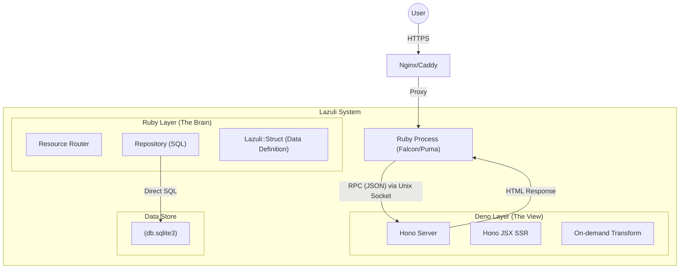

# Lazuli Architecture Design (Part 1)

## 1\. Vision & Core Philosophy

**"Ruby for Thinking, Hono for Rendering."**

Lazuliは、Rubyの「記述性の高さ」と、モダンWeb標準（Deno/Hono）の「パフォーマンス」を、たった1つのサーバープロセスで融合させる **Super Modern Monolith** フレームワークである。

### 3つの原則

1.  **One Server, One DB:**
      * クラウドの複雑性を排除する。Redisも、複雑なDocker構成も不要。
      * 1台のVPSと、1つのSQLite3ファイル（+ Litestream）だけでスケーリングする。
2.  **Explicit over Implicit (Go-like Ruby):**
      * Railsの「暗黙の魔法」を避け、Go言語のように「明示的なデータ定義（Struct）」と「シンプルな関数」を好む。
      * ActiveRecordは使用せず、SQLとStructへのマッピングを基本とする。
3.  **HTML First, JS Second:**
      * 基本はMPA（Multi-Page Application）。ページ遷移は高速。
      * JavaScriptは必要な箇所（Islands）にのみ「ふりかける」。ビルドステップは存在しない（Zero Node Modules）。

### このフレームワークの「構文の良さ」とは？

- **Rubyは「決定」と「操作」だけを書く**: DBアクセス、分岐、リダイレクト、Turbo Stream operations など「何をしたいか」だけを Ruby に置く。
- **HTML文字列はDenoに委譲**: Rubyはテンプレート生成に関与せず、Deno(Hono JSX)が SSR でHTML（通常ページ/fragment）を生成する。
- **返り値がそのままHTTPの意図になる**: `Render(...)` / `redirect_to(...)` / `stream{...}` のように、コントロールフローがRubyの通常の構文で読める。
- **フック最小・拡張は外側**: アプリ固有の「魔法」を増やさず、Rack/Turbo の標準的な動作の上に薄く載せる。

### DSLを使わない理由

- **メタプログラミング由来の“暗黙”を避ける**: `method_missing`/`class_eval`中心のDSLは追跡が難しく、境界が曖昧になりやすい。
- **型/IDE/テストに強い**: 通常のRubyメソッド・オブジェクトで構成すると Sorbet/静的解析/grep が効きやすく、破壊的変更にも耐える。
- **責務境界を守りやすい**: RubyがHTMLを生成し始めると二重責務になりがちなので、「Ruby=operation、Deno=template」というルールを構文レベルで守れる形にする。

-----

## 2\. System Architecture

Rubyプロセス（脳）とDenoプロセス（顔）が、Unix Domain Socketを介して **1:1** でペアリングされる疎結合アーキテクチャ。



-----

## 3\. Directory Structure (The Zen Layout)

機能単位で分割し、RubyとDenoの境界線を明確にするフラットな構造。

```text
my_app/
├── app/
│   ├── structs/         # [Ruby] データ型・インターフェース定義 (Go-like)
│   ├── repositories/    # [Ruby] データアクセス・SQL実行 (No ActiveRecord)
│   ├── resources/       # [Ruby] URLエンドポイント・ロジック
│   │
│   ├── layouts/         # [Deno] 共通レイアウト (Hono JSX)
│   ├── pages/           # [Deno] ページView (Hono JSX)
│   └── components/      # [Deno] UI部品 & Islands (Hono JSX)
│
├── db/
│   ├── schema.sql       # DBスキーマ定義
│   └── seeds.rb         # 初期データ
│
├── config.ru            # Rubyエントリーポイント
├── deno.json            # Deno/Hono 設定ファイル
└── Gemfile              # Ruby依存関係
```

-----

## 4\. Ruby Layer Design (The Brain)

Ruby層は「HTMLを生成しない」。データの取得、加工、そしてViewへの受け渡し（Instruction）のみに集中する。

### 4-1. Data Definition: `Lazuli::Struct`

ActiveRecordモデルの代わりに、**「画面に返すデータ構造」** を明示的に定義する。Go言語の `struct` に相当し、ここからTypeScriptの型定義が自動生成される。

```ruby
# app/structs/user.rb
class User < Lazuli::Struct
  # DBのカラムと1:1である必要はない。Viewに必要なものだけを定義する。
  attribute :id, Integer
  attribute :name, String
  attribute :email, String
  attribute :role, String
  
  # 計算プロパティも定義可能
  def display_name
    "#{name} (#{role})"
  end
end
```

### 4-2. Data Access: Repository Pattern

ActiveRecordを廃止し、**SQLite3 gem + 薄いラッパー** を採用。SQLを直接記述し、結果を `Lazuli::Struct` にマッピングする。これにより、メモリ効率とパフォーマンスが劇的に向上する。

```ruby
# app/repositories/user_repository.rb
module UserRepository
  extend self

  def all
    # 生SQLを実行 -> ハッシュの配列を取得 -> User Structの配列に変換
    rows = DB.query("SELECT * FROM users ORDER BY created_at DESC")
    User.collect(rows) 
  end

  def find(id)
    row = DB.query_single("SELECT * FROM users WHERE id = ?", id)
    User.new(row)
  end
  
  def create(params)
    DB.execute("INSERT INTO users (name, email) VALUES (?, ?)", params[:name], params[:email])
  end
end
```

### 4-3. Logic & Routing: `Lazuli::Resource`

Railsの「Routes + Controller」を統合した概念。クラス構造がそのままURL構造となる。

  * **URLマッピング:** `UsersResource` → `/users`
  * **アクション:** `def index` → `GET /users`

<!-- end list -->

```ruby
# app/resources/users_resource.rb
class UsersResource < Lazuli::Resource
  # TypeScript型定義のために返り値を宣言 (Runtime checkも可能)
  rpc :index, returns: [User]

  def index
    # 1. データの取得 (Repository)
    users = UserRepository.all
    
    # 2. Renderへの指示 (Render Instruction)
    # 実際にHTMLを作るのはDenoの仕事。Rubyはデータを渡すだけ。
    Render "pages/users/index", users: users
  end

  def create
    user = UserRepository.create(params)

    # Turbo Stream: Rubyは操作（operation）だけを組み立てる。
    # - <template> の中身HTMLは Deno が JSX fragment を SSR して生成
    # - Turboは `Accept: text/vnd.turbo-stream.html` を付ける（+ `?format=turbo_stream` も可）
    # - actionが `Lazuli::TurboStream` を返したら、Appが自動で turbo-stream レスポンスに変換する
    stream_or(redirect_to("/users")) do |t|
      t.prepend "users_list", "components/UserRow", user: user
    end
  end
end
```

-----

*(後半へ続く：Deno層の設計、通信プロトコル、Frontend戦略について)*

# Lazuli Architecture Design (Part 2)

## 5\. Deno Layer Design (The Render)

Deno層は「アプリケーションサーバー」ではなく、**「超高性能なビューエンジン」** として振る舞う。Hono がリクエストを受け、Hono JSX が高速に HTML を生成する。

### 5-1. Configuration: Single `deno.json`

複雑なビルド設定（Vite/Webpack）は存在しない。すべての依存関係とコンパイラ設定は、標準の `deno.json` ひとつに集約される。

```json
// deno.json
{
  "tasks": {
    "start": "deno run -A --unstable-net adapter/server.ts"
  },
  "imports": {
    "hono": "npm:hono@^4",
    "hono/": "npm:hono@^4/",
    "hono/jsx": "npm:hono@^4/jsx",
    "hono/jsx/dom": "npm:hono@^4/jsx/dom"
  },
  "compilerOptions": {
    "jsx": "react-jsx",
    "jsxImportSource": "hono/jsx"
  }
}
```

### 5-2. Server Implementation: Pure Hono

Denoアダプターの実態は、極限まで薄い Hono アプリケーションである。

```typescript
// packages/lazuli/assets/adapter/server.tsx
import { Hono } from "hono";
import { html } from "hono/html";

const app = new Hono();

// 1. RPC Endpoint: Rubyからのレンダリング依頼
app.post("/render", async (c) => {
  const { page, props } = await c.req.json();
  
  // 動的インポートでコンポーネントを読み込む
  const PageComponent = (await import(`../../app/pages/${page}.tsx`)).default;
  const Layout = (await import(`../../app/layouts/Application.tsx`)).default;

  // Hono JSXによる高速SSR
  const body = html`${
    <Layout>
      <PageComponent {...props} />
    </Layout>
  }`;

  return c.html(`<!DOCTYPE html>${body}`);
});

// 2. Asset Server: オンデマンド変換
// ブラウザからのリクエストに対し、esbuildでTSXをJSに変換して返す（バンドルはしない）
app.get("/assets/*", async (c) => { /* ... transform logic ... */ });

export default app;
```

-----

## 6\. Frontend Strategy (Zero Node Modules)

JSバンドルサイズを極小化し、ビルドステップを排除するため、**「Zero Node Modules」** 戦略を採用する。

### 6-1. Navigation: Turbo Drive

SPAのような「ぬるぬる動く」ページ遷移は、**Turbo Drive** によって実現する。
Ruby/Denoは通常のHTMLを返すが、Turboが `<body>` を差分更新するため、ブラウザのリロードは発生しない。これにカスタムコードは一切不要である。

#### Turbo Frames（hooks最小）

Turbo Frames は、フレームワーク側の特別な仕組みを増やさずに使える。
ユーザーがHTML側で `<turbo-frame id="...">` を書くだけで、Turboが対象フレームの置換を行う。
Lazuliは「Rubyは操作やデータ、DenoはHTMLレンダリング」という責務分離を維持し、Frames専用APIは基本的に提供しない（必要なら将来的に frame request 判定などを追加）。

### 6-2. Interactivity: Islands Architecture with Hono JSX

動的なUI（カウンタ、モーダル等）が必要な場合のみ、Hono JSX をクライアントサイドで起動（Hydrate）する。
ブラウザ側では `esm.sh` を経由して Hono をロードするため、`node_modules` は不要である。

**Component Definition:**

```tsx
// app/components/Counter.tsx
import { useState } from "hono/jsx";

export default function Counter(props) {
  const [count, setCount] = useState(props.initialCount);
  
  return (
    <button onClick={() => setCount(c => c + 1)} class="btn">
      Count: {count}
    </button>
  );
}
```

**Client-side Hydration:**

```html
<div id="island-1">...</div>
<script type="module">
  import { render } from "hono/jsx/dom";
  import { jsx } from "hono/jsx";
  import Component from "/assets/components/Counter.tsx";
  
  const el = document.getElementById("island-1");
  render(jsx(Component, { initialCount: 10 }), el);
</script>
```

-----

## 7\. Type Safety & Workflow

RubyとTypeScriptという異なる言語間で、どのように安全性を担保するか。

### 7-1. Code Generation (The Bridge)

`Lazuli::Struct` の定義変更を検知し、TypeScriptの型定義ファイル (`client.d.ts`) を自動生成する。

  * **Ruby:** `attribute :name, String`
  * **TypeScript:** `name: string;`

これにより、フロントエンド開発時（VS Code等）に、Rubyから渡ってくる `props` の型補完が完璧に効くようになる。

### 7-2. Development Loop

1.  **Modify:** `app/resources/user_resource.rb` を変更。
2.  **Request:** ブラウザをリロード。
3.  **Detect:** Rubyが変更を検知し、Denoプロセスを高速リスタート。
4.  **Render:** 最新のコードで即座に反映。

-----

## 8\. Summary: Why Lazuli?

このアーキテクチャは、Web開発における「3つの分断」を解決する。

1.  **バックエンド vs フロントエンドの分断**
      * 👉 **解決:** ResourceとPageが1対1対応し、Structで型がつながるため、一人の開発者がシームレスに行き来できる。
2.  **開発効率 vs パフォーマンスの分断**
      * 👉 **解決:** Rubyで素早く書き、HonoとSQLiteで爆速に動かす。
3.  **SPA vs MPA の分断**
      * 👉 **解決:** TurboでMPAの良さ（SEO、シンプルさ）を維持しつつ、Hono JSX IslandsでSPAの良さ（インタラクティブ性）を取り込む。

**Lazuli Architecture** は、個人の生産性を最大化し、かつ数万ユーザー規模までスケール可能な、現代の「個人開発者・小規模チーム」のための究極の武器である。