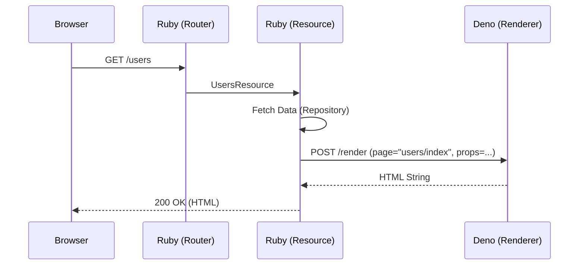

# Lazuli Internal Architecture

This document details the implementation design of the Lazuli framework, specifically focusing on the interaction between the Ruby and Deno layers.

## 1. Process Model

Lazuli operates on a **Master-Worker** process model to maintain the "One Server" philosophy.

*   **Master Process (Ruby):**
    *   Entry point of the application (`config.ru`).
    *   Handles HTTP requests from the outside (Nginx/Caddy).
    *   Manages the lifecycle of the Deno process.
    *   Responsible for business logic, database access, and routing.
*   **Worker Process (Deno):**
    *   Spawned and monitored by the Ruby process.
    *   Listens on a Unix Domain Socket (e.g., `tmp/sockets/lazuli-renderer.sock`).
    *   Responsible for SSR (SolidJS) and Asset bundling (esbuild).
    *   Stateless (mostly).

### Boot Sequence

1.  **Ruby Boot:** `bundle exec rackup` starts the Ruby server.
2.  **Lazuli Init:** `Lazuli::App` initializes.
3.  **Socket Check:** Ruby checks for existing socket files and cleans them up.
4.  **Deno Spawn:** Ruby spawns `deno run -A --unstable-net assets/adapter/server.ts --socket tmp/sockets/lazuli-renderer.sock`.
5.  **Health Check:** Ruby waits for the socket to be ready (connects and pings).
6.  **Ready:** Server starts accepting HTTP traffic.

## 2. IPC Protocol (Ruby <-> Deno)

Communication happens over HTTP via Unix Domain Socket. Ruby acts as the HTTP Client, and Deno acts as the HTTP Server (Hono).

### Endpoints

#### `POST /render`
Renders a SolidJS page component to HTML.

*   **Request (JSON):**
    ```json
    {
      "page": "users/index",  // Path to component relative to app/pages
      "props": {              // Data object (serialized Lazuli::Structs)
        "users": [
          { "id": 1, "name": "Alice" },
          { "id": 2, "name": "Bob" }
        ]
      }
    }
    ```
*   **Response (HTML):**
    ```html
    <!DOCTYPE html>
    <html>
      <head>...</head>
      <body>
        <div id="root">...rendered html...</div>
        <script type="module">...</script> <!-- Hydration scripts -->
      </body>
    </html>
    ```

#### `GET /assets/*`
Serves static assets or on-demand compiled JavaScript.

*   **Usage:**
    *   In **Development**: Ruby proxies requests starting with `/assets/` to the Deno socket.
    *   In **Production**: Nginx/Caddy should serve precompiled assets directly from disk, bypassing Ruby/Deno for performance.

## 3. Request Lifecycle



## 4. Hot Reloading (Development)

*   **Ruby Changes:** `rerun` or similar gem restarts the Ruby process. Deno process is killed and restarted.
*   **Deno/Frontend Changes:**
    *   Deno watches `app/` directory.
    *   When a `.tsx` file changes, Deno clears its internal module cache.
    *   Next request to `/render` uses the new code.
    *   Browser needs to reload (Turbo Drive handles this or manual reload).

## 5. Directory Structure Mapping

| Concept | Ruby Path | Deno Path |
| :--- | :--- | :--- |
| **Structs** | `app/structs/*.rb` | `app/types/*.d.ts` (Generated) |
| **Resources** | `app/resources/*_resource.rb` | N/A |
| **Pages** | N/A | `app/pages/*.tsx` |
| **Components** | N/A | `app/components/*.tsx` |
