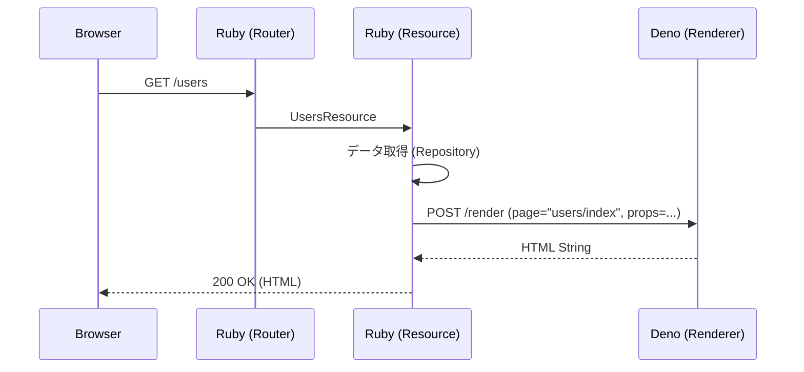

# アーキテクチャ設計

Lazuliは、Rubyの堅牢なバックエンドエコシステムと、Deno/Honoのモダンなフロントエンドレンダリング能力を組み合わせたハイブリッドフレームワークです。

## 1. プロセスモデル

Lazuliは Ruby (Rack) と Deno (Renderer/Assets) の **2プロセス** で動作します。

*   **Rack Process (Ruby):**
    *   アプリケーションのエントリーポイント (`config.ru`)。
    *   `Lazuli::App` として外部からのHTTPリクエストを処理します。
    *   ビジネスロジック、データベースアクセス、ルーティングを担当します。
*   **Renderer Process (Deno):**
    *   Unix Domain Socket (例: `tmp/sockets/lazuli-renderer.sock`) で待機します。
    *   **Hono JSX** によるSSR、アセット提供、Turbo Streams の `<template>` 断片（JSX fragment）生成を担当します。
    *   基本的にステートレスです。

### ライフサイクル（起動方法）

*   **開発/統合起動:** `lazuli dev` が `Lazuli::ServerRunner` として Rack + Deno を同時に起動し、終了シグナルで両方を確実に停止します。
*   **Rack単体起動:** `bundle exec rackup` / `lazuli server` は Rack のみ起動します（Deno spawn はしません）。Renderer は別プロセスで起動してください（例: `deno run -A --unstable-net --config "$(pwd)/deno.json" "$(bundle show lazuli)/assets/adapter/server.tsx" --app-root $(pwd) --socket $(pwd)/tmp/sockets/lazuli-renderer.sock`）。

Turbo Streams の `<template>` 断片は Ruby では生成せず、Ruby は「operation を積む」だけに徹し、Deno が JSX fragment をレンダリングします。Ruby 側は `stream { ... }`（=`turbo_stream`）で操作を組み立て、`t.append "list", "components/Row", id: 1` のように `props:` を省略できます。

また、第一引数が `#` / `.` / `[` で始まる場合は `targets:` の省略記法として扱います（例: `t.remove "#users_list li"`）。

### 起動シーケンス（lazuli dev）

1.  **Runner Boot:** `Lazuli::ServerRunner` が起動。
2.  **Socket Check:** 既存のソケットファイルを確認し、クリーンアップします。
3.  **Deno Spawn:** `deno run -A --unstable-net --config "$(pwd)/deno.json" "$(bundle show lazuli)/assets/adapter/server.tsx" --app-root $(pwd) --socket $(pwd)/tmp/sockets/lazuli-renderer.sock` でRendererを起動し、socket ready を待ちます。
4.  **Rack Spawn:** `bundle exec rackup` でRackサーバーを起動します。
5.  **Ready:** HTTPトラフィックの受け付けを開始します。

## 2. IPCプロトコル (Ruby <-> Deno)

通信はUnix Domain Socket上のHTTPで行われます。RubyがHTTPクライアント、DenoがHTTPサーバー (Hono) として動作します。

### エンドポイント

#### `POST /render`
Hono JSXで **ページ** をHTMLにレンダリングします。

*   **Request (JSON):**
    ```json
    {
      "page": "users/index", // app/pages/users/index.tsx（拡張子なし）
      "props": {
        "users": [
          { "id": 1, "name": "Alice" },
          { "id": 2, "name": "Bob" }
        ]
      }
    }
    ```

*   **Response (HTML):**
    ```html
    <!DOCTYPE html>
    <html>
      <head>...</head>
      <body>...rendered html...</body>
    </html>
    ```

> Layout は `app/layouts/Application.tsx` が使われます。

#### `POST /render_turbo_stream`
Turbo Streams の `<template>` 内HTML（JSX fragment）をレンダリングします。

*   **Request (JSON):**
    ```json
    {
      "streams": [
        {
          "action": "append",
          "target": "users_list",
          "fragment": "components/UserRow",
          "props": { "user": { "id": 1, "name": "Alice" } }
        }
      ]
    }
    ```

*   **Response:** `Content-Type: text/vnd.turbo-stream.html; charset=utf-8`

Fragments は `app/<fragment>.tsx` から読み込まれます（例: `app/components/UserRow.tsx`）。

#### `GET /assets/*`
静的アセットまたはオンデマンドでコンパイルされたJavaScriptを提供します。

*   **機能:**
    *   **オンデマンドトランスパイル:** `.tsx` ファイルへのリクエストを受け取ると、ブラウザで実行可能なJavaScriptに変換して返します。
    *   **Import Map解決:** サーバーサイドの `npm:` インポートを、ブラウザ互換の `https://esm.sh/` URLに自動的に書き換えます。これにより、複雑なバンドル設定なしでライブラリを使用できます。

## 3. リクエストライフサイクル



## 4. Island Architecture

Lazuliは **Island Architecture** を採用しており、ページ全体ではなく、必要な部分だけをインタラクティブにします。

*   **サーバーサイド:** `<Island />` コンポーネントは、ラップされたコンポーネントを静的HTMLとしてレンダリングし、同時に `data-lazuli-island` / `data-lazuli-props` を出力します。
*   **レンダラ側（自動）:** HTML に `data-lazuli-island` が含まれる場合のみ、Renderer（Deno）が hydration runtime を `<head>` に自動注入します（ユーザーが script を書く必要はありません）。
*   **クライアントサイド:** ブラウザは自動注入された runtime が `hono/jsx/dom` を使って、指定されたコンポーネントをマウントします。

補足: **pageモジュール**の先頭に `"use hydration";` がある場合、Renderer（Deno）がページ全体を自動で Island 化（`data-lazuli-island` を付与）し、hydration runtime を注入します。

## 5. ディレクトリ構成マッピング

| 概念 | Ruby パス | Deno パス |
| :--- | :--- | :--- |
| **Structs** | `app/structs/*.rb` | `app/types/*.d.ts` (推奨) |
| **Resources** | `app/resources/*_resource.rb` | N/A |
| **Pages** | N/A | `app/pages/**/*.tsx` |
| **Layouts** | N/A | `app/layouts/*.tsx` |
| **Components / Fragments** | N/A | `app/components/**/*.tsx` |

## 6. Performance（計測と改善ロードマップ）

Lazuli は「Ruby が routing/operation、Deno が HTML/JSX 生成」という 2 プロセス構成のため、**Rack 本体の性能**に加えて **Ruby↔Deno の IPC（Unix socket）**のコストが支配的になりやすいです。

### ローカルベンチ（現状の読み）

`packages/example/bin/bench` は loopback 上での簡易 HTTP 負荷テストで、回帰（改善/劣化）の検知に使う想定です（絶対値の比較というより“変化”を見る）。

目安:

- SSR（/todos）: concurrency=20 で **~650–790 rps / avg ~25–31ms / p95 ~36–46ms**
- SSR + Islands（/）: SSR より **~+5–10ms 程度**（hydration runtime 注入 + props + island マークアップ分）
- Turbo Stream（POST /todos）: concurrency=4 で **~460–510 rps / avg ~8ms**

### 改善の優先順（提案）

1. **Falcon（Rack サーバ）**
   - Ruby 側の同時接続耐性を上げ、IPC の待ち時間を“隠せる”ようにする。
   - **実装済み:** `lazuli server --falcon` / `lazuli dev --falcon` で Falcon を使って起動できます（`falcon` gem が必要。未導入なら rackup にフォールバック）。
2. **YJIT（Ruby）**
   - CPU-bound な Ruby 側（ルーティング/JSON/ストリーム組み立て/DB の薄い層）の底上げ。
   - **実装済み:** `lazuli server --yjit` / `lazuli dev --yjit` で Ruby 側の YJIT を opt-in できます。
3. **Oj（JSON）**
   - `POST /render` / `POST /render_turbo_stream` / RPC など、Ruby↔Deno 間の JSON encode/decode を高速化。
   - **実装済み:** `Lazuli::Json` を追加し、Oj が入っていれば自動で Oj を使います（未導入なら標準 JSON にフォールバック）。
4. **async 化（I/O 待ちを隠す）**
   - IPC 呼び出しや DB など I/O を並列化できるよう、将来の Async/Fiber 前提の設計余地を確保。
   - **実装済み（下地）:** Renderer の keep-alive socket は Fiber scheduler 有効時に **Fiber 単位**で分離されるため、将来の Fiber 並列でも安全に拡張できます。
5. **UNIX 接続プール（Renderer socket）**
   - Renderer への接続確立（Unix socket connect）をリクエストごとに行わない。
   - **実装済み:** `Lazuli::Renderer` が keep-alive socket をキャッシュして再利用します（通常は thread-local／Fiber scheduler 有効時は Fiber 単位。エラー時は破棄して再接続）。

### 受け入れ基準（例）

- `packages/example/bin/bench` を複数回回しても、SSR/Islands/Streams の **p95 が大きく悪化しない**こと。
- 改善タスクは “ベンチの出力を PR に貼る” ことで差分が追えること（数字は環境依存なので増減の理由説明を重視）。
