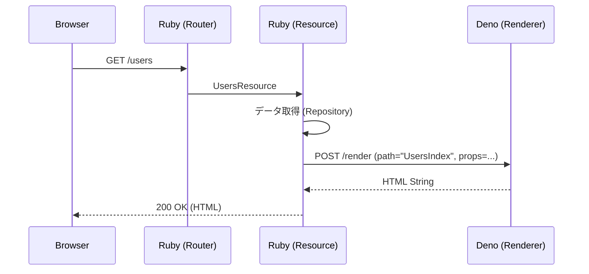

# アーキテクチャ設計

Lazuliは、Rubyの堅牢なバックエンドエコシステムと、Deno/Honoのモダンなフロントエンドレンダリング能力を組み合わせたハイブリッドフレームワークです。

## 1. プロセスモデル

Lazuliは「One Server」の哲学を維持するために、**Master-Worker** プロセスモデルで動作します。

*   **Master Process (Ruby):**
    *   アプリケーションのエントリーポイント (`config.ru`)。
    *   外部からのHTTPリクエストを処理します。
    *   Denoプロセスのライフサイクルを管理します。
    *   ビジネスロジック、データベースアクセス、ルーティングを担当します。
*   **Worker Process (Deno):**
    *   Rubyプロセスによって起動・監視されます。
    *   Unix Domain Socket (例: `tmp/sockets/lazuli-renderer.sock`) で待機します。
    *   **Hono JSX** を使用したSSR (Server-Side Rendering) と、アセットのオンデマンド変換を担当します。
    *   基本的にステートレスです。

### 起動シーケンス

1.  **Ruby Boot:** `bundle exec rackup` でRubyサーバーが起動。
2.  **Lazuli Init:** `Lazuli::App` が初期化されます。
3.  **Socket Check:** Rubyは既存のソケットファイルを確認し、クリーンアップします。
4.  **Deno Spawn:** Rubyは `deno run -A --unstable-net ...` コマンドでDenoプロセスを起動します。
5.  **Health Check:** Rubyはソケットの準備ができるまで待機します（接続確認）。
6.  **Ready:** サーバーがHTTPトラフィックの受け付けを開始します。

## 2. IPCプロトコル (Ruby <-> Deno)

通信はUnix Domain Socket上のHTTPで行われます。RubyがHTTPクライアント、DenoがHTTPサーバー (Hono) として動作します。

### エンドポイント

#### `POST /render`
Hono JSXコンポーネントをHTMLにレンダリングします。

*   **Request (JSON):**
    ```json
    {
      "path": "UsersIndex",   // app/views/UsersIndex.tsx へのパス
      "props": {              // データオブジェクト (シリアライズされたLazuli::Structs)
        "users": [
          { "id": 1, "name": "Alice" },
          { "id": 2, "name": "Bob" }
        ]
      }
    }
    ```
*   **Response (HTML):**
    ```html
    <!DOCTYPE html>
    <html>
      <head>...</head>
      <body>
        <div id="root">...rendered html...</div>
        <script type="module">...</script> <!-- Hydration scripts -->
      </body>
    </html>
    ```

#### `GET /assets/*`
静的アセットまたはオンデマンドでコンパイルされたJavaScriptを提供します。

*   **機能:**
    *   **オンデマンドトランスパイル:** `.tsx` ファイルへのリクエストを受け取ると、ブラウザで実行可能なJavaScriptに変換して返します。
    *   **Import Map解決:** サーバーサイドの `npm:` インポートを、ブラウザ互換の `https://esm.sh/` URLに自動的に書き換えます。これにより、複雑なバンドル設定なしでライブラリを使用できます。

## 3. リクエストライフサイクル



## 4. Island Architecture

Lazuliは **Island Architecture** を採用しており、ページ全体ではなく、必要な部分だけをインタラクティブにします。

*   **サーバーサイド:** `<Island />` コンポーネントは、ラップされたコンポーネントを静的HTMLとしてレンダリングし、同時にクライアントサイドでのHydration用の `<script>` タグを出力します。
*   **クライアントサイド:** ブラウザは生成されたスクリプトを実行し、`hono/jsx/dom` を使用して指定されたコンポーネントをマウントします。

## 5. ディレクトリ構成マッピング

| 概念 | Ruby パス | Deno パス |
| :--- | :--- | :--- |
| **Structs** | `app/structs/*.rb` | `app/types/*.d.ts` (推奨) |
| **Resources** | `app/resources/*_resource.rb` | N/A |
| **Views** | N/A | `app/views/*.tsx` |
| **Components** | N/A | `app/views/components/*.tsx` |
